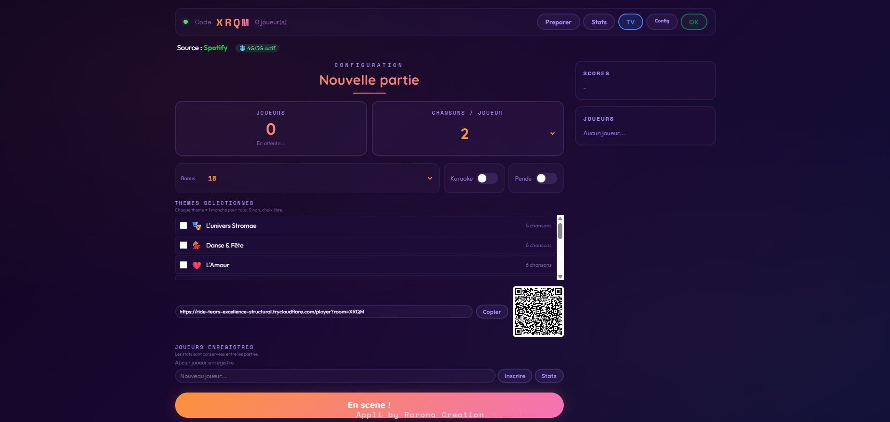
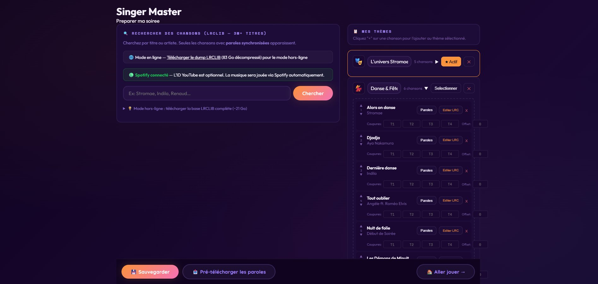
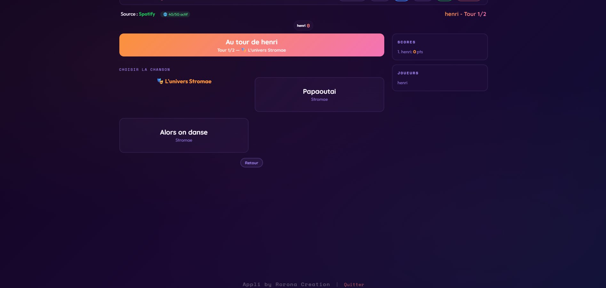
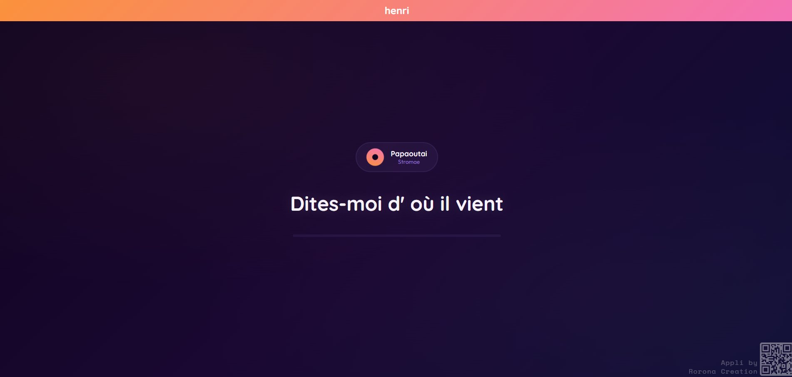

<div align="center">

# ♪ Singer Master

### Jeu musical multijoueur inspiré de "N'oubliez pas les paroles"

[](https://github.com/cookhenri-art/singer-master/releases)
[](./LICENSE)
[](#installation)
[](#fonctionnalités)
[](#sécurité)

**[⬇️ Télécharger](https://github.com/cookhenri-art/singer-master/releases/latest)** &nbsp;·&nbsp;
**[🌐 Site officiel](https://roronoa-games.com/product-singer-master.html)** &nbsp;·&nbsp;
**[🐛 Signaler un bug](https://github.com/cookhenri-art/singer-master/issues)**

---

**三刀流 · Santōryū Style** — une création [RORONOA GAMES](https://roronoa-games.com)

</div>

---

## ✨ Aperçu

Singer Master est un jeu musical multijoueur inspiré de l'émission TV **"N'oubliez pas les paroles !"**. Un hôte lance des chansons, la musique s'arrête à un moment clé, et les joueurs doivent retrouver les paroles manquantes sur leur téléphone. Le logiciel est :

- 🎵 **Multijoueur local + distant** — jusqu'à 20 joueurs via WiFi ou tunnel 4G/5G
- 🎤 **Spotify + YouTube** — lecture musicale professionnelle via les APIs officielles
- 📱 **Cross-device** — hôte sur PC, joueurs sur smartphone via QR code
- 🎙️ **Dictée vocale** — les joueurs peuvent répondre à la voix (Web Speech API)
- 🔒 **100 % local** — les données restent sur votre PC, aucun serveur tiers
- 🌿 **Freeware** — usage personnel et soirées entre amis, aucun compte requis

## 📸 Captures d'écran

| Configuration de partie | Préparation des thèmes |
|:---:|:---:|
|  |  |

| Choix de chanson | Paroles à retrouver |
|:---:|:---:|
|  |  |

## 🎯 Fonctionnalités

### Gameplay
- **Mode classique** : 4 coupures de musique par chanson (3, 5, 7, 10 mots à trouver)
- **Mode karaoké** : paroles défilantes avec suppression de la voix (si piste disponible)
- **Mode pendu** : les mots trouvés dévoilent les lettres des autres
- **Bonus parfait** : +15 pts si toutes les coupures sont réussies
- **Bonus sans joker** : +10 pts supplémentaires si aucun joker utilisé sur la chanson

### Système de jokers (3 par joueur/partie)
- ⭐ **Révélation** : dévoile 3 mots au hasard
- 💡 **Indice** : affiche la ligne de paroles suivante
- 🔤 **Initiales** : montre la première lettre de chaque mot à trouver

### Thèmes et chansons
- **Thèmes pré-configurés** : Danse, Amour, Années 80/90/2000, Stromae, et plus
- **Thèmes personnalisés** : créez vos propres playlists
- **Édition des paroles** : modifiez les LRC (paroles synchronisées) directement dans l'app
- **Édition des coupures** : ajustez les 4 points T1-T4 par chanson
- **Double offset** : correction des paroles séparée pour mode normal 🎵 et karaoké 🎤

### Multijoueur
- **Connexion locale** : QR code scanné depuis n'importe quel smartphone
- **Connexion distante** : tunnel Cloudflare intégré pour jouer à distance (4G/5G)
- **Mode spectateur TV** : écran dédié pour afficher le jeu sur une télé
- **Reconnexion automatique** : les joueurs peuvent fermer/rouvrir leur navigateur
- **Dictée vocale** : remplir les champs à la voix au lieu de taper

### Statistiques joueurs
- Profils persistants avec nombre de parties, moyenne, victoires, meilleure série
- **Classement Maestro** : top des meilleures séries de victoires consécutives
- **Calcul de la meilleure moyenne sur 10 parties consécutives**
- Administration des profils : renommer ✏️ et supprimer 🗑️ les joueurs
- Export RGPD des données par joueur (JSON téléchargeable)

### Administration
- Page **Préparer** : gestion complète des thèmes, chansons, paroles, timings
- Page **Config** : connexion Spotify, tunnel Cloudflare, paramètres système
- Backup automatique des données joueurs (3 dernières versions conservées)
- Purge automatique des comptes inactifs > 24 mois

## 💾 Installation

### Windows (recommandé)

1. Télécharger **[SingerMaster-Setup.exe](https://github.com/cookhenri-art/singer-master/releases/latest)**
2. Double-cliquer pour installer
3. Lancer depuis le menu Démarrer — l'app se lance en arrière-plan (icône tray)
4. Le navigateur s'ouvre automatiquement sur l'écran hôte

> **Note antivirus** : l'installeur NSIS peut être temporairement signalé par certains antivirus (faux positif connu). Vérifier le hash SHA-256 publié dans la release GitHub. Une version portable sans installation est disponible ci-dessous.

### Version portable (Windows, sans installation)

1. Télécharger **[SingerMaster-Portable.zip](https://github.com/cookhenri-art/singer-master/releases/latest)** (~90 Mo)
2. Décompresser dans un dossier
3. Double-cliquer sur `LANCER.bat` — Node.js est embarqué, aucune installation requise
4. Pour arrêter : fermer la fenêtre noire ou utiliser `ARRETER.bat`

### Build from source (Mac / Linux)

```bash
git clone https://github.com/cookhenri-art/singer-master.git
cd singer-master
npm install
npm run build:mac    # ou build:linux
```

## 🚀 Démarrage rapide

### Pour l'hôte
1. **Lancer** Singer Master — le navigateur s'ouvre
2. **Première fois** : aller dans Config, coller vos clés Spotify (Client ID + Secret)
3. **Préparer** : choisir ou créer des thèmes de chansons
4. **Nouvelle partie** : configurer nombre de joueurs et chansons/joueur
5. **Partager le QR code** — les joueurs scannent pour rejoindre
6. **Lancer** — la musique démarre, les joueurs répondent sur leur téléphone

### Pour les joueurs
1. **Scanner le QR code** affiché par l'hôte (ou ouvrir l'URL donnée)
2. **Entrer son pseudo** — se reconnecter avec le même pseudo récupère les stats
3. **Écouter la chanson** — la musique s'arrête à 4 moments clés
4. **Remplir les trous** — à la main ou à la voix via le bouton 🎤
5. **Envoyer** — les réponses apparaissent en temps réel sur l'écran hôte

### Configuration Spotify

Pour utiliser Spotify comme source audio :

1. Créer une app sur [developer.spotify.com](https://developer.spotify.com/dashboard)
2. Ajouter `http://127.0.0.1:3000/spotify/callback` dans les Redirect URIs
3. Copier le **Client ID** et le **Client Secret** dans Config → Spotify
4. Cliquer sur "Connecter Spotify" — l'OAuth se fait automatiquement
5. Le token est **persistant** — plus besoin de se reconnecter à chaque lancement

Sans Spotify, YouTube est utilisé automatiquement comme source audio.

## 🔒 Vie privée

Singer Master respecte votre vie privée par conception :

- ❌ Aucun serveur cloud, aucune télémétrie, aucun analytics
- ❌ Aucun compte, aucune inscription, aucun email collecté
- ❌ Aucun tracker, aucun cookie tiers
- ✅ Les données joueurs sont stockées **uniquement en local** (dossier `data/`)
- ✅ Aucun traitement de données sensibles (seuls des pseudos + statistiques de jeu)
- ✅ Fonctionnement local possible sans Internet (sauf Spotify/YouTube qui requièrent leurs APIs)
- ✅ Durées de conservation définies (purge auto après 24 mois d'inactivité)

**Note sur Spotify** : le SDK Spotify exige techniquement le scope `user-read-email` pour fonctionner. Singer Master **ne lit ni ne stocke jamais votre email** — c'est une exigence du SDK, pas un choix.

Conforme RGPD. Voir [REGISTRE_TRAITEMENTS_RGPD.md](./REGISTRE_TRAITEMENTS_RGPD.md), [PROCEDURE_VIOLATION_DONNEES.md](./PROCEDURE_VIOLATION_DONNEES.md), politique de confidentialité accessible depuis l'app.

## 🛡️ Sécurité

Le code est audité selon **OWASP Top 10** et les standards 2025-2026. L'application a passé un audit complet **Red Team avec veille offensive** et obtient un score de **98/100**. Les protections incluent :

- ✅ **Headers HTTP** sécurisés via Helmet (CSP, HSTS, X-Frame-Options, Referrer-Policy)
- ✅ **Rate limiting** 3 niveaux (API: 120/min, setup: 20/15min, strict: 10/min) + Socket.IO 30 msg/sec
- ✅ **Endpoints sensibles** protégés : 14 routes `localhostOnly` + 6 routes bloquées via tunnel
- ✅ **Protection XSS** : échappement systématique de toutes les sorties HTML (32 points vérifiés)
- ✅ **Validation stricte** des entrées utilisateur : pseudos, paroles, thèmes, scores
- ✅ **Sanitisation anti-injection** des paroles tierces (LRCLIB) : XSS, RTL override, zero-width chars, bombes de taille
- ✅ **Socket.IO** : auth middleware, rate limit par socket, validation des événements
- ✅ **Tokens Spotify** : stockage persistant sécurisé, jamais exposés via le tunnel
- ✅ **SRI hashes** sur les scripts CDN externes
- ✅ **Étanchéité totale** vérifiée : aucune écriture hors dossier app, aucun SSRF, aucun eval, aucun exec déclenchable à distance

Un [rapport d'audit complet Red Team](./RED_TEAM_REPORT.md) est disponible (50 vecteurs testés, veille offensive sur CVE 2025-2026).

**Signaler une faille de sécurité** : créer une [issue privée](https://github.com/cookhenri-art/singer-master/security/advisories/new) plutôt qu'une issue publique.

## 📋 Spécifications techniques

| Propriété | Valeur |
|---|---|
| Version | 1.0.0 |
| Plateformes | Windows 10/11 (.exe), Mac (.dmg), Linux (.AppImage), Portable (.zip) |
| Poids EXE | ≈ 100 MB (Electron + dépendances) |
| Poids Portable | ≈ 90 MB (Node.js embarqué) |
| Stack | Node.js 20+, Express 4, Socket.IO 4.8, Electron 33 |
| Audio | Spotify Web Playback SDK, YouTube IFrame API |
| Paroles | LRCLIB (synchronisées) + édition manuelle |
| Réseau distant | Cloudflare Tunnel (auto-installation) |
| Joueurs simultanés | 2 à 20 |
| Licence | Freeware (voir [LICENSE](./LICENSE)) |
| Langue UI | Français |

## 🎶 Droits musicaux

Singer Master utilise des APIs officielles pour la lecture audio :

- **Spotify** : usage via le Web Playback SDK nécessite un compte Premium pour l'hôte
- **YouTube** : lecture via l'IFrame API selon les conditions YouTube
- **LRCLIB** : base communautaire de paroles synchronisées (pas de licence formelle)

⚠️ **Usage commercial** (bars, événements payants, streaming public) : nécessite une analyse juridique préalable. Les Developer Terms de Spotify (section 3.1) interdisent explicitement l'usage dans des "games". Pour un usage commercial, contacter Spotify Partner Support ou basculer sur YouTube exclusivement. En France, la diffusion publique de musique nécessite également une licence SACEM indépendamment de la source technique.

Voir [BUILD.md](./BUILD.md) pour le détail des droits musicaux et la checklist pré-distribution.

## 🤝 Contribuer

Ce projet est freeware mais pas open source au sens strict (voir [LICENSE](./LICENSE)). Vous êtes toutefois encouragé à :

- 🐛 **Signaler des bugs** via les [Issues](https://github.com/cookhenri-art/singer-master/issues)
- 💡 **Proposer des fonctionnalités** dans les Discussions
- 🎵 **Partager vos thèmes personnalisés** (export JSON des presets)
- 📚 **Partager vos soirées** sur les réseaux sociaux avec le tag `#SingerMaster`
- 🌍 **Traduire l'interface** (contactez [RORONOA GAMES](https://roronoa-games.com) pour coordonner)

## 📦 Autres produits RORONOA GAMES

| Produit | Description |
|---|---|
| [Les Saboteurs](https://saboteurs.roronoa-games.com) | Jeu de déduction sociale multijoueur (6-12 joueurs) |
| [Chess Battle Camp](https://roronoa-games.itch.io/chess-battle-camp) | Stratégie tour par tour 3D sur grille hexagonale |
| [GeoTag](https://geotag.roronoa-games.com) | Réseau social géolocalisé PWA |
| [Overlay Animation Studio](https://github.com/cookhenri-art/OverlayAnimStudio) | Éditeur neon d'overlays animés pour streams |
| [StemSampler Pro](https://github.com/cookhenri-art/stemsampler-pro) | Plugin VST3/CLAP — séparation de stems par IA |
| **AI Factory Studio** | Studio IA local tout-en-un (bientôt) |

→ [Catalogue complet sur roronoa-games.com](https://roronoa-games.com/products.html)

## 📜 Licence

Singer Master est distribué sous une licence **Freeware** pour usage personnel (soirées entre amis, événements privés non rémunérés). L'usage commercial (bars, événements payants, streaming monétisé) nécessite une analyse juridique préalable des droits musicaux. Voir [LICENSE](./LICENSE) pour les conditions complètes.

© 2026 RORONOA GAMES. Tous droits réservés.

---

<div align="center">

**[🏠 Site officiel](https://roronoa-games.com)** &nbsp;·&nbsp;
**[📱 @roronoa.games](https://www.instagram.com/roronoa_games/)** &nbsp;·&nbsp;
**[📘 Facebook](https://www.facebook.com/profile.php?id=61587474752031)** &nbsp;·&nbsp;
**[🎵 Camhenco sur Spotify](https://open.spotify.com/intl-fr/artist/04OndO5DLKuUWjNlw3NBN1)**

**三刀流 · Santōryū Style**

</div>
